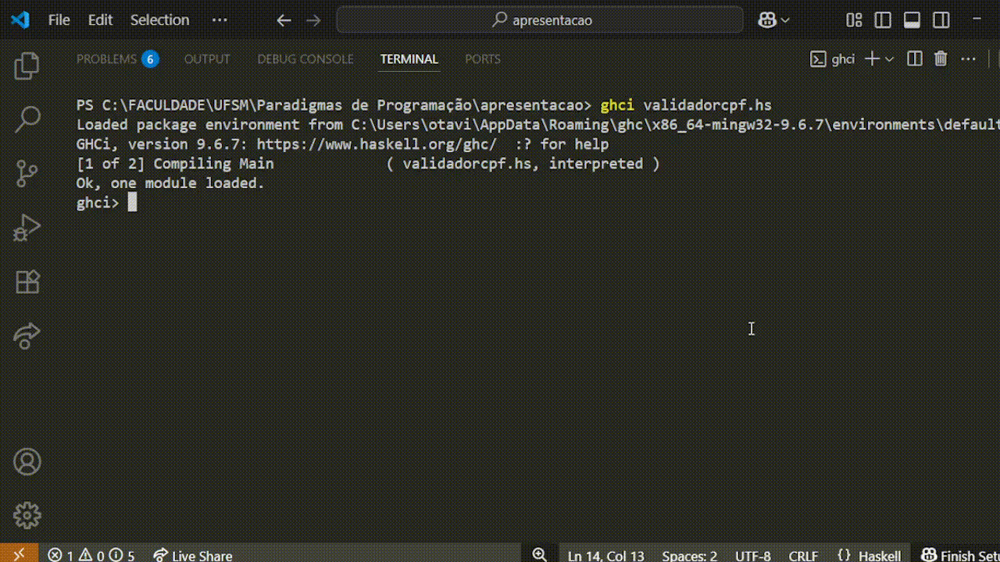
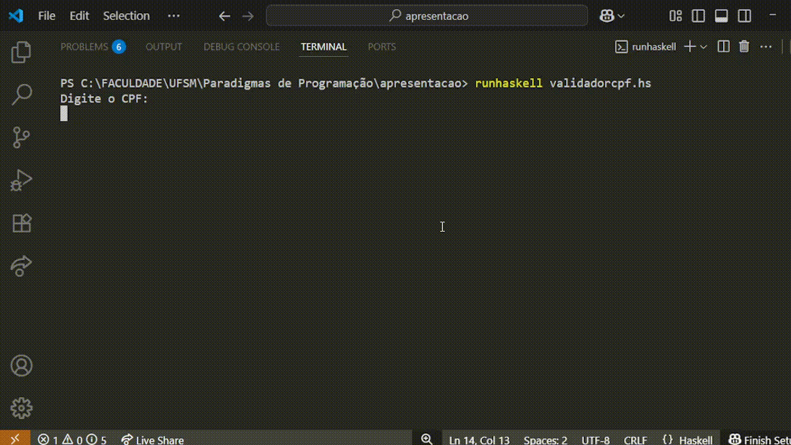
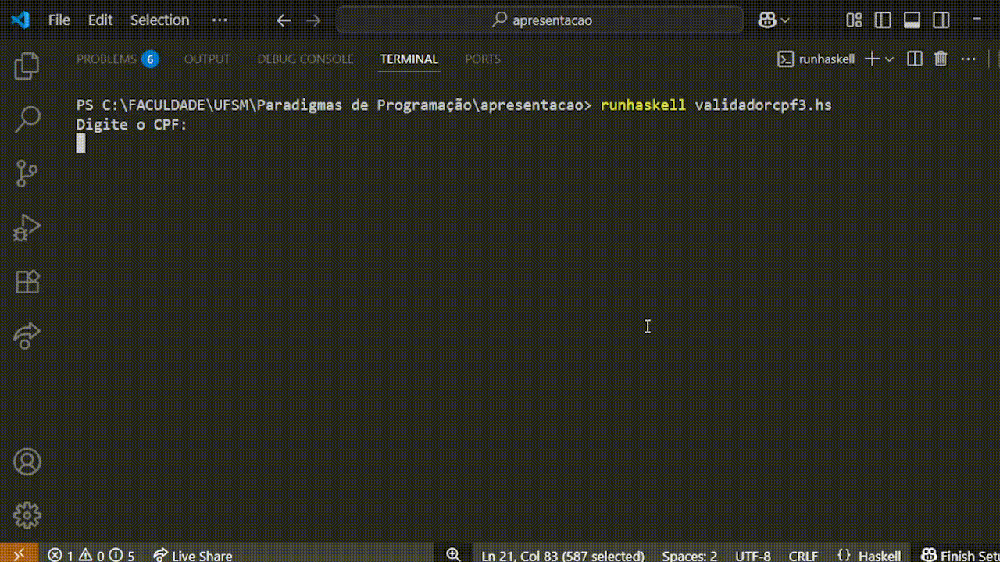

# Validação de CPF

Esta tarefa consistia em estudar o código de validação de CPF, contido na aula 8, e reescrevê-lo trocando *let* por *where* e *where* por *let*. O *where* permite declarar variáveis e funções de apoio depois da expressão principal, enquanto o *let* define esses elementos antes da expressão onde serão usados. Para compreender o código, ele foi apresentado em duas linguagens: primeiro em C e, depois, em Haskell.

## Componentes de um CPF

Um CPF possui ao todo 11 dígitos, sendo os 2 últimos dígitos verificadores, calculados a partir dos anteriores. Exemplo: 529.982.247-25.

## Cálculo dos dígitos verificadores do CPF

Para calcular o primeiro dígito verificador, é necessário multiplicar cada um dos 9 primeiros dígitos por um valor multiplicador correspondente, que inicia em 10 e vai até 2 ([10,9...,2]). Depois, calcula-se o somatório das multiplicações e, após, o resto da divisão do somatório por 11. Por último, é necessário ajustar o dígito aplicando a condição `DV1 = if DV1 < 2 then 0 else 11-DV1`.

Para calcular o segundo dígito verificador, é necessário multiplicar cada um dos 10 primeiros dígitos (o que inclui também o primeiro dígito verificador) por um valor multiplicador correspondente, que inicia em 11 e vai até 2 ([11,10...,2]). Depois, calcula-se o somatório das multiplicações e, após, o resto da divisão do somatório por 11. Por último, é necessário ajustar o dígito aplicando a condição `DV2 = if DV2 < 2 then 0 else 11-DV2`.

## Código de validação de CPF em C
<pre>// Desenvolva um programa que aceita e valida o CPF- Cadastro de Pessoa Física.
// Copyright Prof. Omero Francisco Bertol, M.Sc.

#include "stdio.h"
#include "stdlib.h"

void main() {
  int sm, i, r, num;
  char dig10, dig11, cpf[11];
  printf("Informe o valor do CPF:\n");
  gets(cpf);

// calcula o 1o. digito verificador do CPF
  sm = 0;
  for (i=0; i<9; i++) {
    num = cpf[i] - 48;	// transforma o caracter '0' no inteiro 0
			// (48 eh a posição de '0' na tabela ASCII)
    sm = sm + (num * (10 - i));  
  }
  r = 11 - (sm % 11);
  if ((r == 10) || (r == 11))
     dig10 = '0';
  else
     dig10 = r + 48;

// calcula o 2o. digito verificador do CPF
  sm = 0;
  for (i=0; i<10; i++) {
    num = cpf[i] - 48;
    sm = sm + (num * (11 - i));
  }
  r = 11 - (sm % 11);  
  if ((r == 10) || (r == 11))
     dig11 = '0';
  else
     dig11 = r + 48;

// compara os dígitos calculados com os dígitos informados
  if ((dig10 == cpf[9]) && (dig11 == cpf[10]))
     printf("\nO CPF informado eh válido.");
  else
     printf("\nO CPF informado eh inválido.");
}</pre>

## Código de validação de CPF em Haskell
<pre>import Data.Char

cpfValid :: [Int] -> Bool
cpfValid cpf =
  let digits = take 9 cpf
      dv1 = cpfDV digits [10,9..]
      dv2 = cpfDV (digits ++ [dv1]) [11,10..]
   in dv1 == cpf !! 9 && dv2 == cpf !! 10

cpfDV :: [Int] -> [Int] -> Int
cpfDV digits mults = if res < 2 then 0 else 11-res
  where res = (sum $ zipWith (*) digits mults) `mod` 11

main :: IO()
main = do
 putStrLn "Digite o CPF: "
 cpf <- getLine
 let digits = (map digitToInt cpf)
 putStrLn (if cpfValid digits then "Válido" else "Inválido")</pre>

## Teste de funções
### cpfDV

### cpfValidTrue

### cpfValidFalse

### Rodando main

Depois de analisar, compreender e testar o código, primeiramente em C e depois a versão em Haskell, reescrevi o código em Haskell trocando let por where e where por let.

## Primeira versão do código reescrito
A primeira versão que reescrevi do código, a qual pode ser visualizada abaixo, apresentou erro:
<pre>import Data.Char

cpfValid :: [Int] -> Bool
cpfValid cpf = dv1 == cpf !! 9 && dv2 == cpf !! 10
  where digits = take 9 cpf
        dv1 = cpfDV digits [10,9..]
        dv2 = cpfDV (digits ++ [dv1]) [11,10..]

cpfDV :: [Int] -> [Int] -> Int
cpfDV digits mults =
  let res = (sum $ zipWith (*) digits mults) `mod` 11
   in if res < 2 then 0 else 11-res

main :: IO()
main = do
 putStrLn "Digite o CPF: "
 cpf <- getLine
 putStrLn (if cpfValid digits then "Válido" else "Inválido")
   where digits = (map digitToInt cpf)</pre>

Nessa versão, tentei fazer a troca de todos os `let` por `where` e `where` por `let`. Porém, percebi que a função main apresentava um `let` diferente, sem conter o `in`. Ao reescrever e trocar por `where`, o terminal apresentou o seguinte erro:

<pre>validadorcpf2.hs:19:34: error: [GHC-88464]
    Variable not in scope: cpf :: [Char]  
   |
19 |    where digits = map digitToInt cpf 
   |
</pre>

Isso acontece porque em Haskell, o `where` está sempre associado a uma "equação" (definição de função ou valor) e enxerga apenas nomes que estão disponíveis no mesmo nível da definição da função ou em escopos externos.
Já um bloco `do` cria seu próprio escopo local: variáveis introduzidas com `<-` ou `let` dentro do `do` só existem ali dentro.
Por isso, quando tenta-se usar `cpf` no `where` associado a `main`, o compilador gera o erro *Not in scope: cpf*, pois esse `cpf` não faz parte do escopo da definição de `main`, mas apenas do escopo interno do `do`.

## Segunda versão do código reescrito
Após entender o problema, reescrevi o código de um modo um pouco diferente dentro da função `main`, o que pode ser visualizado na segunda versão do código reescrito em Haskell:

<pre>import Data.Char

cpfValid :: [Int] -> Bool
cpfValid cpf = dv1 == cpf !! 9 && dv2 == cpf !! 10
  where digits = take 9 cpf
        dv1 = cpfDV digits [10,9..]
        dv2 = cpfDV (digits ++ [dv1]) [11,10..]

cpfDV :: [Int] -> [Int] -> Int
cpfDV digits mults =
  let res = (sum $ zipWith (*) digits mults) `mod` 11
   in if res < 2 then 0 else 11-res

main :: IO()
main = do
  putStrLn "Digite o CPF: "
  cpf <- getLine
  putStrLn (validar cpf)
  where
    validar :: String -> String
    validar cpf' = if cpfValid (map digitToInt cpf') then "Válido" else "Inválido"</pre>

Desta vez, optei por criar a função auxiliar `validar` dentro do bloco `where`, de modo que ela é chamada dentro do `putStrLn`, com o argumento `cpf`, obtido com o `<- getLine`. Nessa função, o argumento foi nomeado `cpf'` para evitar conflito de escopo. Assim, `cpf'` representa a entrada recebida pela função auxiliar, e o que `validar` retorna é a *String* **"Válido"** ou **"Inválido"**, dependendo da verificação do CPF.

### Nova versão

A função `validar` adquiriu escopo de função local no *main*.

É importante salientar que esse jeito vai um pouco contra o conceito de funções "puras", que caracterizam Haskell, dificultando a reutilização do código. Portanto, não é o jeito mais "adequado" manter uma função auxiliar dentro do main :: IO().

## Recursos desconhecidos presentes no código

### $
O **$** em Haskell é o chamado function application operator (operador de aplicação de função). Ele serve para reduzir parênteses, sem mudar o resultado do código.

Exemplo:

#### Sem $:

<pre>sum (map (*2) [1,2,3,4])</pre>

#### Com $:

<pre>sum $ map (*2) [1,2,3,4]</pre>

### digitToInt
digitToInt é uma função do módulo Data.Char que converte um caractere numérico ('0'..'9') em um inteiro correspondente (0..9).

#### Assinatura da função:

<pre>digitToInt :: Char -> Int</pre>

#### Exemplo de uso:

<pre>import Data.Char

digitToInt '0'  -- retorna 0
digitToInt '5'  -- retorna 5
digitToInt '9'  -- retorna 9</pre>

#### No código do CPF:

<pre>map digitToInt cpf</pre>

Converte a string lida pelo usuário ("12345678909", por exemplo) em uma lista de inteiros: [1,2,3,4,5,6,7,8,9,0,9].

**Observação**:
se você passar um caractere que não seja dígito, a função gera erro.

### IO

**IO** a é o tipo de ações de entrada/saída (Input/Output) em Haskell. O IO indica que a função interage com o mundo externo (como ler teclado, imprimir na tela ou acessar arquivos).

No caso específico de IO (), o **()** significa que a ação não produz um valor útil para ser manipulado, apenas realiza o efeito colateral (como imprimir na tela).

#### Exemplo:

<pre>main :: IO ()
main = putStrLn "Olá, mundo!"</pre>

O exemplo acima imprime uma mensagem na tela, mas não retorna um valor “útil” que possa ser usado em expressões.

#### Outro exemplo:

<pre>getLine :: IO String</pre>

Este exemplo lê uma linha do teclado e produz uma String dentro de IO. Para usar essa String, é preciso extrair seu valor com `<-` dentro de um *do block*:

<pre>main :: IO ()
main = do
  linha <- getLine
  putStrLn ("Você digitou: " ++ linha)</pre>

Aqui, linha tem tipo String e pode ser manipulada normalmente, enquanto a ação continua sendo de tipo IO ().

### Arithmetic Sequences

Arithmetic Sequences em Haskell são uma sintaxe de lista por enumeração. Funcionam da seguinte maneira: [start, next..end], gerando uma lista começando em start, com passo next-start, até chegar (ou passar) no end. Se o end é omitido, como em [10,9..], o Haskell entende que é para continuar decrementando indefinidamente.

<pre>[10,9..]  -- gera [10,9,8,7,6,5,4,3,2,1,0,-1,...]</pre>

No caso do código que valida o CPF, funciona bem com o `ZipWith`, porque zipWith vai combinar apenas o número de elementos necessários da outra lista (digits), então o fato de [10,9..] ser “infinitamente grande” não atrapalha.

<pre>cpfValid :: [Int] -> Bool
cpfValid cpf =
  let digits = take 9 cpf
      dv1 = cpfDV digits [10,9..]
      dv2 = cpfDV (digits ++ [dv1]) [11,10..]
   in dv1 == cpf !! 9 && dv2 == cpf !! 10

cpfDV :: [Int] -> [Int] -> Int
cpfDV digits mults = if res < 2 then 0 else 11-res
  where res = (sum $ zipWith (*) digits mults) `mod` 11</pre>

## Fontes:
- https://stackoverflow.com/questions/50804295/do-statement-under-a-where-clause

- https://www.haskell.org/tutorial/patterns.html

- https://wiki.haskell.org/Let_vs._Where

- https://wiki.haskell.org/$

- https://hackage.haskell.org/package/base-4.21.0.0/docs/Data-Char.html#v:digitToInt

- https://www.haskell.org/tutorial/io.html

- http://www.zvon.org/other/haskell/Outputsyntax/arithmeticQsequences_reference.html
